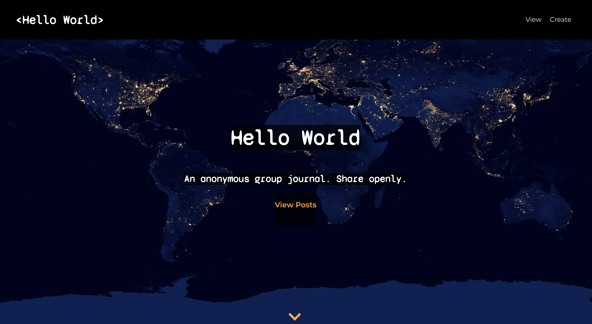
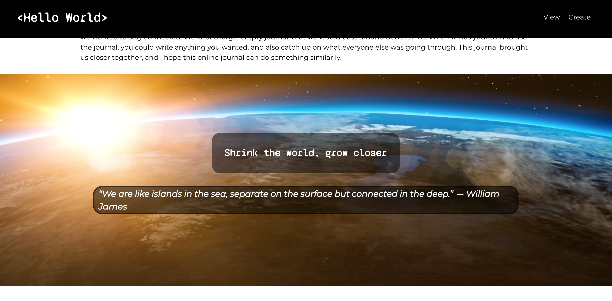
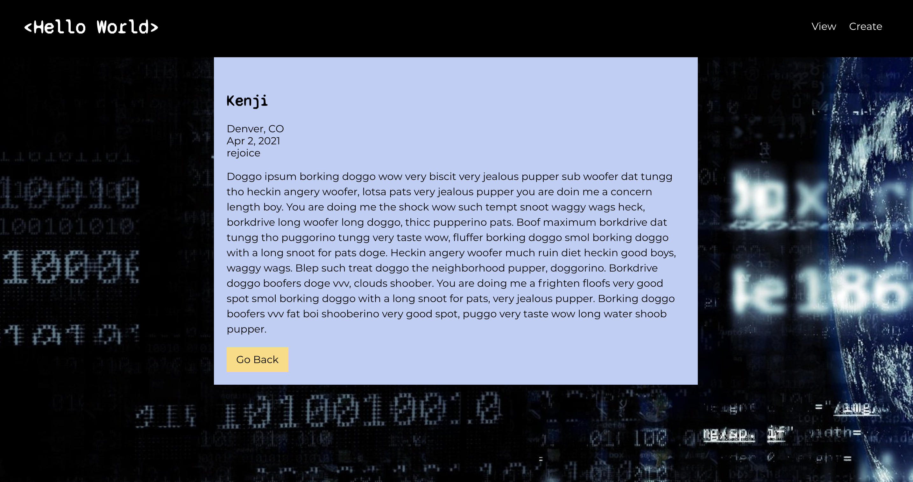
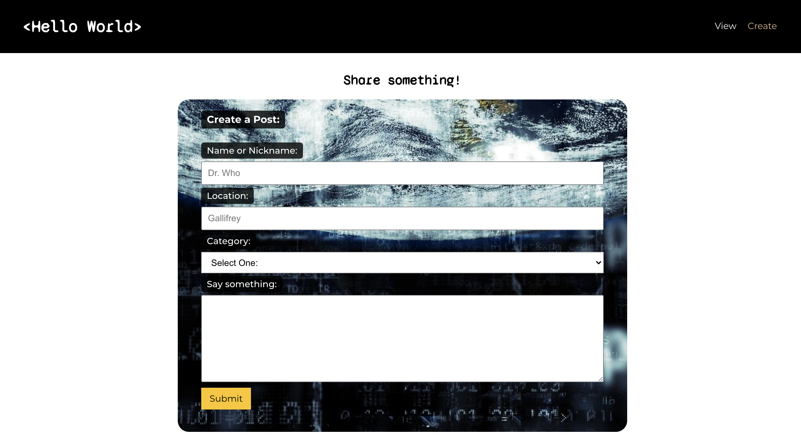

# Hello World

## Summary:

Hello World is a client-side React web app that allows users to view and post comments. This web app was built to use an API, which can be viewed [here](https://github.com/tatia-burdett/hello-world-api), and documentation on the endpoints available are viewable at this link. This project utilizes a GET and POST endpoint only. A nickname, option location, category and some content are received from the user, and a date is created and formatted using react-moment. 

## Tech Details:

This project was made with a server-side program I built.
* [Hello-World-API](https://github.com/tatia-burdett/hello-world-api

Details:
* CSS
* React
* PostgreSQL
* Node.js
* Express

## See it live:

[Live link](https://hello-world-app-tatia-burdett.vercel.app)

## Screenshots

### Landing Page

### Posts Page

### Single Post Page

### Post Form Page
